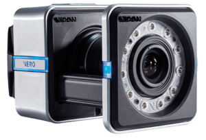
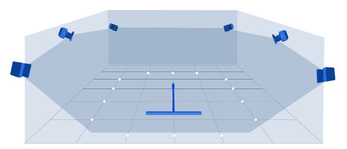

This guide will give you a quick place to start when you need to re-position Vicon cameras.

# Our System Specs
- 8 VICON Vero 2.2 cameras
- 1 Ethernet switch
- 1 control PC running Vicon Tracker
- Custom railing suspended from ceiling (where cameras were mounted)

# Our System Requirements
Make sure you think about what you’re going to be doing with the system before you start.
- Large tracking volume (WxLxH)
- Primarily ground robots and aerial drones

# How to Position Cameras
Choosing a position for the cameras can be difficult since it requires routing cables to the camera. This is easy if your cameras are close to the ground (e.g., on stands), but for our application, this meant moving a larger ladder back and forth to reroute cables and adjust cameras.

To maximize our efficiency when setting up the cameras, we set up a perimeter of reflective markers around our desired area. This allowed us to quickly see if there was a location that was not seen by the cameras.

# Tips for Camera Setup

*Figure: A Vicon setup figure with markers lining the desired coverage area.*

- Each marker needs to be seen by at least 3 cameras. Redundancy is good since depending on an objects orientation, light pollution, cleanness of markers, etc. may cause a camera to lose sight in some places.
- The cameras have a rectangular field of view, so use this wisely when choosing camera placement.
- When calibrating camera settings (software and hardware), start “all the way out” or “all the way in” on both and systematically adjust the parameters.
- Light will affect the cameras if it is very close (e.g., a fluorescent light ~1ft. away) and in the camera’s view. Outdoor light does not seem to impact the cameras much.
- You can use the calibration wand to do a double check on the boundaries of the cameras and to see how high up the cameras can see (height of the volume).
- Each object (defined in VICON Tracker) requires 3 markers to define. 

# Software Settings (Vicon Tracker)
Definitions are from the User Guide. They are the main software calibration settings you’ll need to consider. See page 135 for an explanation of the different Tracker views (you should definitely know these before starting).

- **Max Blob Height:** “The maximum number of pixels per line that a grayscale blob can
contain in a horizontal line.”
- **Threshold:** “The minimum brightness (intensity) for markers; pixels of an intensity
lower than this threshold are ignored.”
- **Minimum Circularity Ratio:** “The circularity threshold used by the centroid-fitting algorithms in a Vicon camera.”
- **Strobe Intensity:** “The amount of light emitted by camera strobe units.” Generally, start this all the way up and Threshold all the way down.

# Hardware Settings (on camera)
Couldn’t find official definitions for these…

- **Focus:** This will help the camera see the markers more clearly, which will improve tracking. See page 4 in the Vero Quick Start Guide for images of what the markers should and shouldn’t look like.
- **Zoom:** Increasing zoom will decrease the area seen by that camera…just like a 2D (cell phone) camera.
- **Aperture:** This allows more or less light in. If you are having trouble seeing markers, open this all the way.

# Other Tips
- If anything is going wrong, re-calibrate the system first. If that doesn’t work, reboot the system including the PC.
- You can position an object’s coordinate system to a desired location by dragging/rotating the object’s coordinate system in Vicon Tracker.
- You can turn off snapping while re-positioning by going to Window>Objects and uncheck Global Snap.