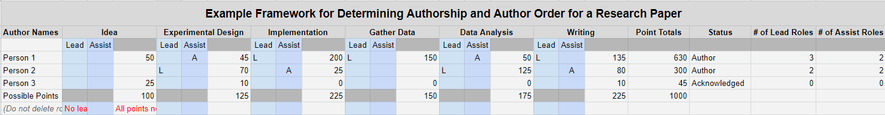
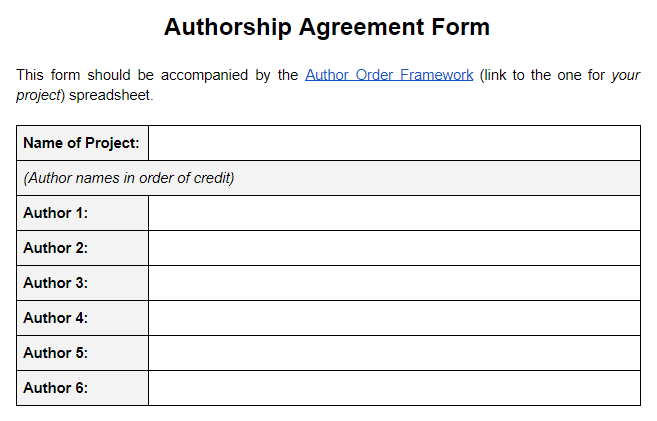

Authorship disputes are a persistent problem in academia, and they often lead to feelings of resentment. These disputes are a waste of energy, discouraging, and (mostly) avoidable. To reduce the chance of disputes in my lab, I reviewed a couple of journal papers on authorship guidelines and an example or two that other labs had posted online, and I decided to make my own version for our lab. I wanted a system that could be procedurally followed rather than disparate guidelines.

A process that systemizes determining authorship has to assist with the distribution of the work and responsibility: a kind of project management tool. Once this is done, authorship and authorship order fall into place more easily with the help of some predetermined criteria, thresholds, and guidelines. It also has to formalize and finalize the process in an explicit agreement of authorship and authorship order.

## Framework: Assigning Work and Responsibility
In terms of work, there are five main components to producing most research papers. I am writing from the perspective of our lab, which deals with human subject data primarily, but I have tried to structure things in a way that is fairly universal.

1. **Idea**: hypothesis, initial literature review, brainstorming
2. **Experimental Design**: protocol, procedure
3. **Implementation**: building/programming/designing/procuring the experimental system
4. **Gather Data**: recruit subjects, run tests/simulations, etc.
5. **Data Analysis**: processing, tables, figures, statistical tests
6. **Writing**: first draft, proofreading, editing, revisions

Assigning responsibility is where the rubber meets the road, and in an attempt to reduce the friction of the process, I systemized it. The benefit of this system is that it breaks things up into bite sized chunks and at least partially quantifies contribution. The point totals for each section have to be discussed and determined.

I pulled a lot of ideas from the [Authorship Order Guidelines](https://kosslynlab.fas.harvard.edu/files/kosslynlab/files/authorship_criteria_nov02.pdf) from the Kosslyn Lab at Harvard. Additionally, the document has useful relevant examples that helped me calibrate my thoughts on dividing up the points, and I highly recommend reading it (it's only two pages). [ICMJE's authorship guidelines](http://www.icmje.org/recommendations/browse/roles-and-responsibilities/defining-the-role-of-authors-and-contributors.html) are also a must-read.

Check out my [Framework Template Spreadsheet](https://docs.google.com/spreadsheets/d/1RMd5TMqfOS1_O89FFLvy08JiPoR34Agliuc4uOwzOVo/edit?usp=sharing).

## Lead and Assist Roles
For each stage of the project listed above, someone needs to take the lead role. The lead should do the majority of the work on that section. They are also responsible for taking meeting notes, updating documentation, and task management (including following up with people on their related tasks) for that section. A lead should be responsible for the majority of work in a section (e.g., 125 out of 200 points).

The assist role(s) for a section should...assist.

## Guidelines for Assigning Lead and Assist Roles
- The first author should have more lead roles than anyone else.
- The first author should be the lead role on writing.
- An assist role may still have a significant portion of work, and the less cooks in the kitchen, the better.

## Agreement: Getting Buy In.
Once the framework is completed and author order has been decided, everyone should sign their name on the authorship agreement form (or type if less formal is OK). This may seem over the top, but it is an important step as there may be considerations that aren't listed on the framework spreadsheet.

## Other Thoughts and Suggestions
- In my experience, revisiting the agreement is expected. The "well, let's wait and see before we decide" excuse will defeat the whole purpose, so my advice is start early and revisit if things shift. Perhaps even set a date at the outset to revisit if all authors are not comfortable with each other.
- The limitations of this framework lie primarily with buy in, which comes from the top down. It is not a perfect system, but if everyone is trying to be proactive, the bumps should be relatively minor. If the adviser/PI appreciates a framework, then I think doing this or similar would be very beneficial. If not, then it can still help streamline projects among lab mates.
- No one should be prevented from authorship by exclusion who is contributing to the paper. I read this principle from another lab's guidelines, and I believe it is very important and pertinent. An example: someone helps with experiments, but they are only acknowledged and never asked if they would like additionally responsibility in the project that would allow them to be an author on the paper.
- A more complex question you may face is how to think about using your or someone else's previous published work (from your research group with permission – this isn't plagiarism) in a current paper/project. The question is, does the previous work count for less when determining the points for each category in the framework. For example, if you previously built a device and on that paper it was "worth" 200 points, should it be "worth" the same or less (and how much less) on this paper? This partially depends on how much the device is contributing/inspiring the new idea, and the novelty of the device (Are there other devices that could be purchased to do the same thing? How much work/creativity would it take to design/build/program the device again?).
- "Contribution should not rely on efficiency. One person should not be penalized for completing their work quickly, having existing skills, etc." Unfortunately, I can't remember the source of this wisdom, but I have paraphrased it.
- This is not meant to be a conflict resolution guide, but rather to make expectations and responsibilities clearer and reduce conflicts.
- For a perspective reset, watch Carl Sagan's Pale Blue Dot. Everything looks bigger up close, and Sagan will show you the world as a tiny speck.

## Resources
- [Defining the Role of Authors and Contributors (ICMJE)](http://www.icmje.org/recommendations/browse/roles-and-responsibilities/defining-the-role-of-authors-and-contributors.html)
- [Definition of Authorship (IEEE)](https://journals.ieeeauthorcenter.ieee.org/become-an-ieee-journal-author/publishing-ethics/definition-of-authorship/)
- [Authorship: Who's on first?](https://www.nature.com/articles/nj7417-591a)
- [Authorship in biomedical research: A sweet fruit of inspiration or a bitter fruit of trade](https://www.ncbi.nlm.nih.gov/pmc/articles/PMC6329266/) Has a good list of types of authorship abuse.
- [Examples of author contribution statements (European Physical Journal)](https://www.epj.org/images/stories/faq/examples-of-author-contributions.pdf)
- [Authorship Order Guidelines from Kosslyn Lab at Harvard](https://kosslynlab.fas.harvard.edu/files/kosslynlab/files/authorship_criteria_nov02.pdf)